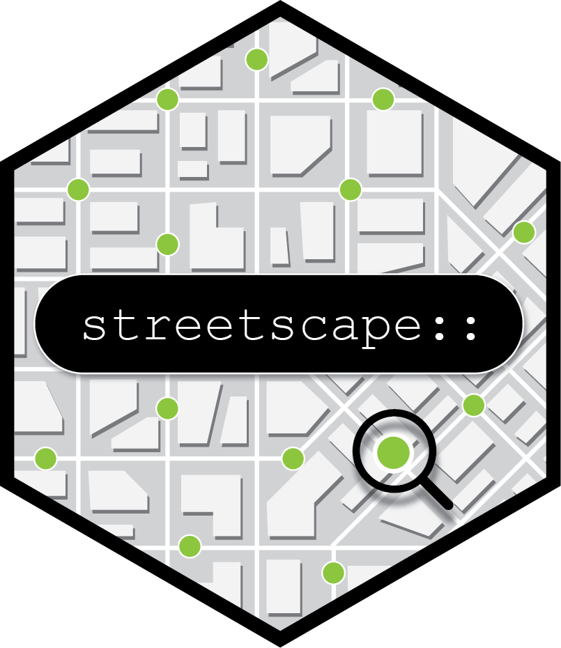

<!-- badges: start -->
[](https://opensource.org/licenses/)
[](https://github.com/land-info-lab/streetscape/actions/workflows/R-CMD-check.yaml)
<!-- badges: end -->

<p align="left">

</p>

# Introduction
A collection of functions to search and download street view imagery 
and to extract, quantify, and visualize visual features. Moreover, handdy functions 
are provided to generate Qualtrics survey in TXT format using the collection of 
street views for various research purposes.

# Installation

``` r
# install the package (develop version) from GitHub
devtools::install_github("land-info-lab/streetscape", dependencies=TRUE)
```

To use the functions for extracting semantic segmentation, 
you need to install the python module `mapbox_vector_tile`.
Then restart the R session:

```r
streetscape::install_mvt()
```

# Usage

## Get your Mapillary API key/token
The foundation of this package is searching and downloading street view meta data 
supported by the Mapillary API. Before using the functions in this package, you can 
[apply for a key/token](https://www.mapillary.com/developer/api-documentation) 
so that you can access the Mapillary data. 

## Get metadata of street view image from Mapillary 
With your Mapillary API key/token, you are able to download streetview meta data.

`streetscape` provides helper function for checking all available meta information:
```r
streetscape::available_field()
```

You can use `strview_search` functions to search and download meta information 
via the Mapillary API by using a buffer, a bbox, a spatial point, or multiple spatial points 
```r
# 1 search data using a buffer
data <- streetscape::strview_searchByGeo(x = -83.741289,
                                         y = 42.270146,
                                         r = 100,
                                         epsg = 2253,
                                         token = "token")
# 2 search data using a bounding box
bbox <- c(-83.751812,42.272984,-83.741255,42.279716)
data <- streetscape::strview_searchByGeo(bbox = bbox,
                                         epsg = 2253,
                                         token = "token")
                                         
# 3 search the nearest data given coordinates in degree (within a 10m buffer)                                   
data <- streetscape::strview_search_nnb(
  x = -83.743460634278,
  y = 42.277848830294,
  epsg = 2253,
  token = 'token')
  
# 4 Sample data points with a boox along the OpenStreetMap roads
bbox <- c(-83.752041,42.274896,-83.740711,42.281945)
data <- streetscape::strview_search_osm(
        bbox = bbox,
        epsg = 2253,
        token = 'token',
        size = 100)
```

You can also search data with some filters. Meanwhile, a helper function is 
provided to check available filters.

```r
# check supported filters
streetscape::available_filter()
# only search for 360-degree street views
data <- streetscape::strview_searchByGeo(bbox = bbox,
                                         epsg = 2253,
                                         token = "token",
                                         is_pano = TRUE)
```

There are more fields you can have when downloading data by specifying `fields`:
```r
data <- streetscape::strview_searchByGeo(x = -83.741289,
                                         y = 42.270146,
                                         r = 100,
                                         epsg = 2253,
                                         fileds = c('captured_at', 'compass_angle')
                                         token = "token")
```

## Extract visual feautures

Semantic segmentation(mask) is included in Mapillary street view database. The functions of 
this package can get the mask as default. Therefore, one can extract this information and 
convert it into polygons or images. Moreover, the function for computing green view index (GVI) 
is designed for calculating the percentage of visible greenness in a scene using images that 
can be collected by the URL link in the meta information.

Assume one already used `strview_search` functions to collect data
```r
# Calculate the percentage of each segmentation
data$decodeDetection()
data$data$segmentation

# extract the semantic segmentation of a street view
mask <- streetviewdata$get_mask(1)

# Calculate the Green View Index
data$gvi()
data$GVI
```

## Map view
```r
# view data in a map view and indicate `fields` to include more properties
map1 <- streetviewdata$mapPreview('meta', 
                                  field=c('computed_altitude', 
                                          'width', 'height'))
print(map1)
# assume that one has run data$gvi() and data$decodeDetection()
map2 <- streetviewdata$mapPreview('seg')
print(map2)
map3 <- streetviewdata$mapPreview('gvi')
print(map3)
```

## Go for surveys
Street view has been widely used in surveys to investigate the quality of urban landscape 
and urban experiences such as safety perception and acoustic experience. You can 
use two functions to construct surveys in txt format that can be imported in Qualtrics.

With `strview2rate`, one can put a set of street views and questions into a survey for 
asking participants to rate or evaluate each image:
```r
# general survey for understanding subjective perception from streetviews
questions <- c('1. To what extent you feel pleasant if you were in this environment', 
              '2. To what extent you feel safe if you were in this environment')
choices <- list(c('Unpleasant','Less pleasant', 'Pleasant', 'More pleasant'), 
                c('Unsafe', 'Less safe','Safe','Safer'))
header <- "Please review the following picture(s):"
streetscape::strview2rate(data, header, questions, choices, file = 'folder/filename')
```


To generate pair-wised comparison survey:
```r
header <- "Please review the following picture(s):"
questions <- c('which one is more beautiful?', 'which one is safer?')
streetscape::strview2pwc(data, k=1, header, questions, file = 'folder/filename')
```


([More instruction of importing text files into Qualtrics](https://www.qualtrics.com/support/survey-platform/survey-module/survey-tools/import-and-export-surveys/))

## Note
Some functions in the package employ multi-core processing to accelerate computation whereas it is not 
available on Windows operation system. 

## Acknowledge 
Thanks for the work of calcualting GVI in R done by Sachit Mahajan. (2023). greenR: An Open-Source Framework for Quantifying Urban Greenness. https://doi.org/10.13140/RG.2.2.36266.18888/1

Thank d-vanos for [importing text files into Qualtrics](https://github.com/d-vanos/Qualtrics-Text-Files/tree/main)

## Issues and bugs
If you discover a bug not associated with connection to the API that is
not already a [reported issue](https://github.com/land-info-lab/streetscape/issues), please [open
a new issue](https://github.com/land-info-lab/streetscape/issues/new)
providing a reproducible example.
